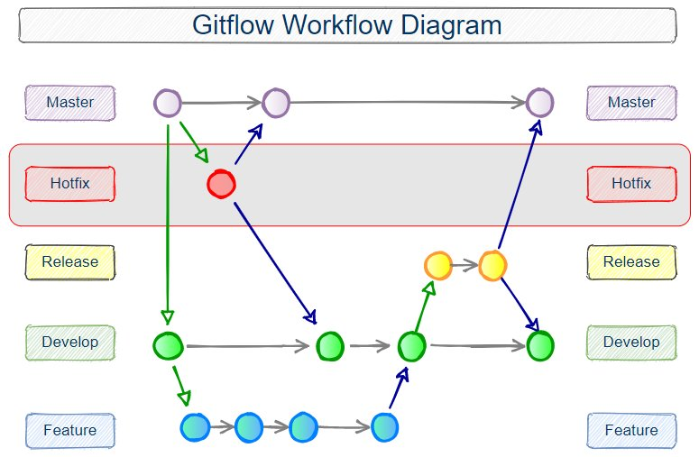
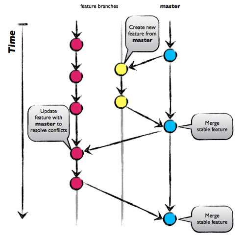
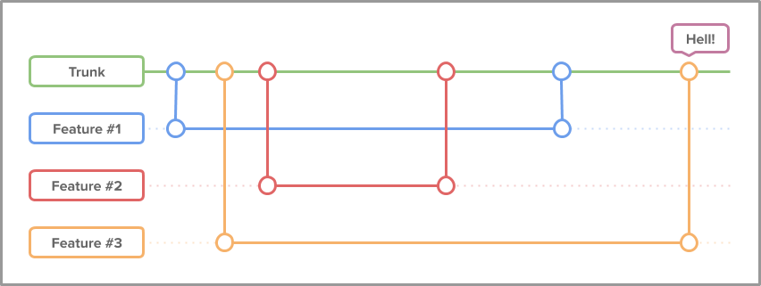

# Git 

## Introduction

Git is a distributed version control system. It is a tool that allows you to track changes in your code and collaborate with other developers. It is a very powerful tool that can be used for many different things.

## Installation

### Windows

1. Download the latest version of Git from [here](https://git-scm.com/download/win).
2. Run the installer and follow the instructions.
3. Open Git Bash and run the following command to configure your name and email address:
    
    ```bash
    git config --global user.name "Your Name"
    git config --global user.email "
    ```

### Mac

1. Download the latest version of Git from [here](https://git-scm.com/download/mac).
2. Run the installer and follow the instructions.
3. Open Terminal and run the following command to configure your name and email address:
    
    ```bash
    git config --global user.name "Your Name"
    git config --global user.email "
    ```

### brew (Mac)

1. Open a terminal and run the following command to install Git:
    
    ```bash
    brew install git
    ```

### Linux

1. Open a terminal and run the following command to install Git:
    
    ```bash
    sudo apt-get install git
    ```

## Basic Commands

### git init

This command is used to initialize a new Git repository. It creates a new subdirectory named `.git` that contains all of your necessary repository files. A bare Git repository contains all of the necessary files for version control, but it does not contain the working directory. This means that you cannot edit files in the repository until you clone it.

example:

```bash
git init
```

### git clone

This command is used to obtain a repository from an existing URL. It creates a new directory, initializes it as a Git repository, and pulls down the latest version of the code.

example:

```bash
git clone
```

### git add

This command is used to add files to the staging area. The staging area is a file, generally contained in your Git directory, that stores information about what will go into your next commit. You can specify a specific file to add or you can add all of the files in your directory by using the `.` character.

example:

```bash
git add .
```

### git commit

This command is used to save your changes to the local repository. It takes a snapshot of the files in the staging area and stores a reference to that snapshot. You must include a commit message that describes the changes you have made.

example:

```bash
git commit -m "Commit message"
```

### git push

This command is used to upload local repository content to a remote repository. Pushing is how you transfer commits from your local repository to a remote repo. It sends the committed changes of master branch to your remote repository.

example:

```bash
git push
```

### git pull

This command is used to fetch and download content from a remote repository and immediately update the local repository to match that content. Pulling is how you transfer commits from a remote repository to your local repo. It fetches the changes from the remote repository and merges them into your local repository.

example:

```bash
git pull
```

### git status

This command is used to list all new or modified files to be committed. It shows the working tree status. It lets you see which changes have been staged, which haven't, and which files aren't being tracked by Git.

example:

```bash
git status
```

### git branch

This command is used to list, create, or delete branches. It is a convenient way to create, delete, and list branches. When you run `git branch` without arguments, it lists all the branches in your repo. It also tells you what branch you're currently in with a `*` symbol. When you run `git branch <branch>` it creates a new branch called `<branch>`.

example:

```bash
git branch
# Create a new branch called <branch>
git branch <branch>

# Delete a branch called <branch>
git branch -d <branch>

# Delete a branch called <branch> (force)
git branch -D <branch>

# Switch to a branch called <branch>
git checkout <branch>
```

## Branching Strategies

### Gitflow

Gitflow is a branching model that was first published and made popular by Vincent Driessen at nvie. It was designed around the project release. This means that there is a `master` branch that always holds the production-ready code and a `develop` branch that always holds the latest code that has been approved for release. The `master` branch is the only branch that should be deployed to production. The `develop` branch is the branch that should be deployed to s



### Github Flow

Github Flow is a lightweight, branch-based workflow that supports teams and projects where deployments are made regularly. This workflow is simpler than a typical Gitflow workflow. It is based on the idea that all feature development should take place in a branch instead of the `master` branch. It is also based on the idea that the `master` branch should be deployable at any time.



### Gitlab Flow

Gitlab Flow is a lightweight, branch-based workflow that supports teams and projects where deployments are made regularly. This workflow is simpler than a typical Gitflow workflow. It is based on the idea that all feature development should take place in a branch instead of the `master` branch. It is also based on the idea that the `master` branch should be deployable at any time.


### Trunk Based Development

Trunk-based development is a branching strategy that in fact requires no branches but instead, developers integrate their changes into a shared trunk at least once a day. This shared trunk should be ready for release anytime.

The main idea behind this strategy is that developers make smaller changes more frequently and thus the goal is to limit long-lasting branches and avoid merge conflicts as all developers work on the same branch. In other words, developers commit directly into the trunk without the use of branches.




