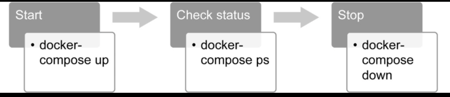
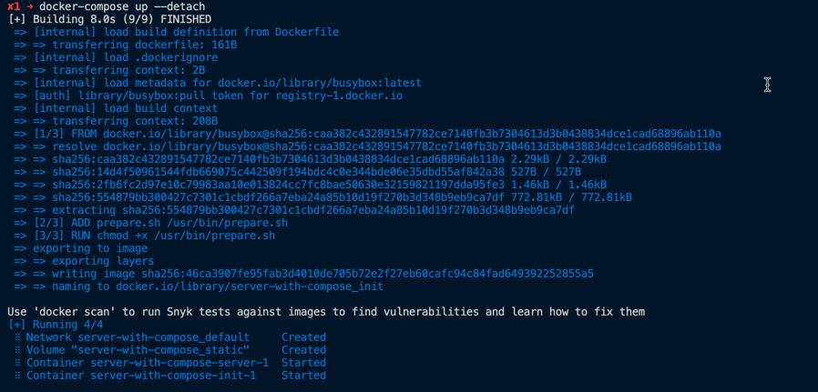
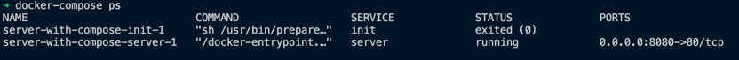
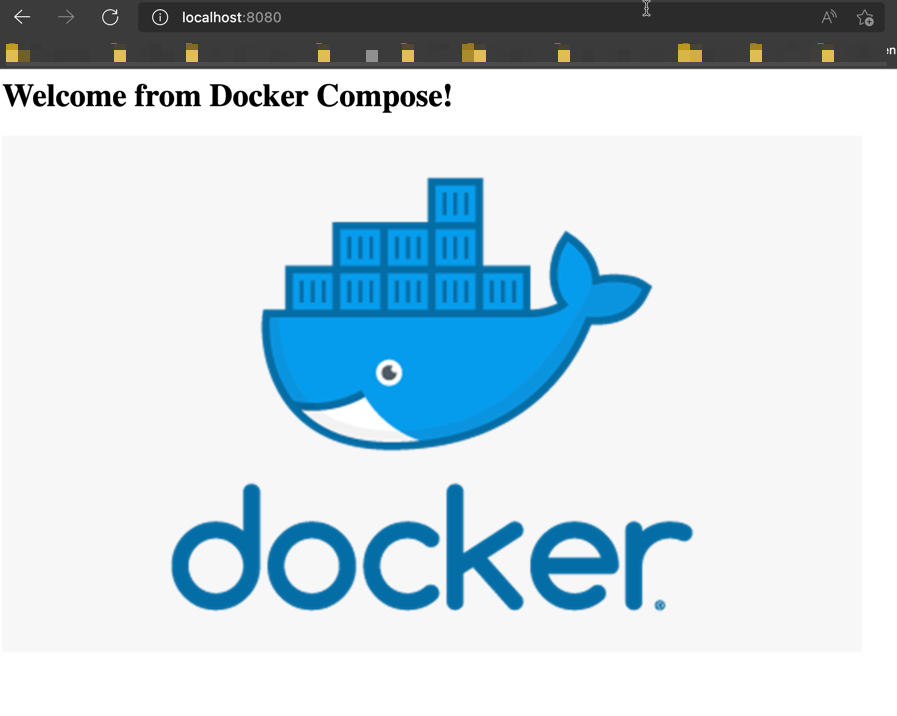
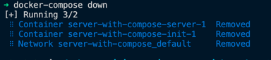

# Composing Environments with Docker Compose

As an example if we take a online shop with frontend, backend and database. So those each microservice are developed with a different language. Those each application are run in different docker containers. Therefore different containers need multiple Dockerfile.

When running those applications, we required to run complex commands and configure and troubleshoot those containers. We can use **Docker Compose** to make it easier. Docker Compose allow us to defining and managing multiple containers.Complex applications such as YAML files can be configured and run with a single command in Docker Compose. It is suitable for various environments, including development, testing, Continuous Integration (CI) pipelines, and production.

We can find following key features in Docker Compose

1. Isolation
2. Stateful data management
3. Iterative design

## Docker Compose CLI

To interact with Docker Engine, Compose uses a CLI tool named docker-compose.

With following command we can install docker-compose

```
# For Linux 

sudo curl -L "https://github.com/docker/compose/releases/download/1.25.0/docker-compose-$(uname -s)-$(uname -m)" -o /usr/local/bin/docker-compose
```

## Docker Compose CLI Commands

Docker Compose commands has the capability of managing the complete life cycle of a Docker Compose application. With sub commands we can start stop and restart the services.

```
docker-compose --help
```

There are three essential docker-compose commands that are used to manage the life cycle of applications. The life cycle and commands can be illustrated as follows:



**_docker-compose up_**: This command creates and starts the containers defined in the configuration. It is possible to build container images or use pre-built images from the registry. In addition, it is possible to run the containers in the background in detached mode with the **_-d_** or **_--detach_**  flags. It is convenient to use detached mode for long-running containers, such as web servers.

**_docker-compose ps_**: This command lists the containers and their status information. It is helpful for troubleshooting and container health checks. For instance, if you create a two-container application with a backend and a frontend, you can check the status of each container with the docker-compose ps command.

**_docker-compose down_**: This command stops and removes all the resources, including containers, networks, images, and volumes.

## Docker Compose File

To use docker-compose CLI commands first we need to create docker-compose.yml file. This file use to define the container configurations and services.

```
version: "3"

services:

  init:

  server:

volumes:

networks:
```

**_version_**: This section defines the syntax version for the docker-compose file, and currently, the latest syntax version is 3.

**_services_**: This section describes the Docker containers that will be built if needed and will be started by docker-compose.

**_networks_**: This section describes the networks that will be used by the services.

**_volumes_**: This section describes the data volumes that will be mounted to the containers in services.

## Exercise 1: Getting Started with Docker Compose

1. Create a folder to store the docker-compose.yml file.

```
mkdir server-with-compose && cd server-with-compose
```

2. Create a folder called init

```
mkdir init && cd init
```

3. Create a bash script called prepare.sh

```
#!/usr/bin/env sh
rm /data/index.html
echo "<h1>Welcome from Docker Compose!</h1>" >> /data/index.html
echo "" >> /data/index.html
```

4. Create a Dockerfile for init container

```
FROM busybox
ADD prepare.sh /usr/bin/prepare.sh
RUN chmod +x /usr/bin/prepare.sh
ENTRYPOINT ["sh", "/usr/bin/prepare.sh"] 
```

5. Change the directry to parent and create a docker-compose.yml file

```
version: "3"
services:
  init:
    build:
      context: ./init
    volumes:
      - static:/data
      
  server:
    image: nginx
    volumes:
      - static:/usr/share/nginx/html  
    ports:
      - "8080:80"
volumes:
  static:
```

6. Start the application with docker-compose up --detach

```
docker-compose up --detach
```

You can see a similar output as below



7. Check the status of the application with docker-compose ps

```
docker-compose ps
```




8. Remove the application with docker-compose down

```
docker-compose down
```



## Exercise 2: Configuring Services with Docker Compose 

From this exercise we will learn how to configure services with environment variables.

1. Create a folder to store the files for the exercise

```
mkdir server-with-configuration && cd server-with-configuration
```

2. Create environment variables file called print.env for the application

```
ENV_FROM_ENV_FILE_1=HELLO
ENV_FROM_ENV_FILE_2=WORLD
```

3. Create docker-compose.yml file

```
version: "3"
services:
  print:
    image: busybox
    command: sh -c 'sleep 5 && env'
    env_file:
    - print.env
    environment:
    - ENV_FROM_COMPOSE_FILE=HELLO
    - ENV_FROM_SHELL
```