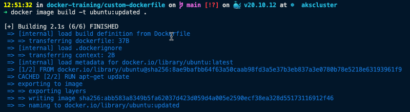

# Getting Started with Dockerfiles

## What Is a Dockerfile?

A **Dockerfile** is a text file that contains instructions on how to create a Docker image. These commands are known as directives. A Dockerfile is a mechanism that we use to create a custom Docker image as per our requirements.

[Dockerfile Documentation](https://docs.docker.com/engine/reference/builder/)

## Common Directives in Dockerfiles

As discussed in the previous section, a directive is a command that is used to create a Docker image. In this section, we will be discussing the following five Dockerfile directives:

1. The **FROM** directive
2. The **LABEL** directive
3. The **RUN** directive
4. The **CMD** directive
5. The **ENTRYPOINT** directive

## The FROM Directive

A Dockerfile usually starts with the **FROM** directive. This is used to specify the parent image of our custom Docker image. The parent image is the starting point of our custom Docker image. All the customization that we do will be applied on top of the parent image. The parent image can be an image from Docker Hub, such as Ubuntu, CentOS, Nginx, and MySQL. The FROM directive takes a valid image name and a tag as arguments. If the tag is not specified, the latest tag will be used.

```
FROM <image>:<tag> 
```

```
FROM ubuntu:20.04
```

## The LABEL Directive

A LABEL is a key-value pair that can be used to add metadata to a Docker image. These labels can be used to organize the Docker images properly. An example would be to add the name of the author of the Dockerfile or the version of the Dockerfile.

```
LABEL <key>=<value>
```

```
LABEL maintainer=kasun@mydomain.com
LABEL version=1.0
LABEL environment=dev
```
Example:

```
LABEL maintainer=kasun@mydomain.com version=1.0 environment=dev
```

## The RUN Directive

The RUN directive is used to execute commands during the image build time. This will create a new layer on top of the existing layer, execute the specified command, and commit the results to the newly created layer. The RUN directive can be used to install the required packages, update the packages, create users and groups, and so on.

```
RUN <command>
```

Example:

```
RUN apt-get update
RUN apt-get install nginx -y
RUN apt-get update && apt-get install nginx -y
```

## The CMD Directive

A Docker container is normally expected to run one process. A CMD directive is used to provide this default initialization command that will be executed when a container is created from the Docker image. A Dockerfile can execute only one CMD directive. If there is more than one CMD directive in the Dockerfile, Docker will execute only the last one.

```
CMD ["executable","param1","param2","param3", ...]
```

Example:

```
CMD ["echo","Hello World"]
```
However, if we send any command-line arguments with **docker container run nginx**, these arguments will take precedence over the CMD command that we defined.

```
docker container run nginx echo "Hello Docker !!!"
```

```
docker container run nginx echo "Hello Docker clear!"
Unable to find image 'nginx:latest' locally
latest: Pulling from library/nginx
f7a1c6dad281: Already exists 
4d3e1d15534c: Pull complete 
9ebb164bd1d8: Pull complete 
59baa8b00c3c: Pull complete 
a41ae70ab6b4: Pull complete 
e3908122b958: Pull complete 
Digest: sha256:1c13bc6de5dfca749c377974146ac05256791ca2fe1979fc8e8278bf0121d285
Status: Downloaded newer image for nginx:latest
Hello Docker clear!
```

## The ENTRYPOINT Directive

Similar to the CMD directive, the ENTRYPOINT directive is also used to provide this default initialization command that will be executed when a container is created from the Docker image. The difference between the CMD directive and the ENTRYPOINT directive is that, unlike the CMD directive, we cannot override the ENTRYPOINT command using the command-line parameters sent with the docker container run command.

NOTE: The **--entrypoint** flag can be sent with the docker container run command to override the default ENTRYPOINT of the image.

```
ENTRYPOINT ["executable","param1","param2","param3", ...]
```
Example:

```
ENTRYPOINT ["echo","Hello"]
CMD ["World"]
```

## Exersise 1: Create a Dockerfile 

1. Create a folder amd cd into it.

```
mkdir custom-dockerfile && cd custom-dockerfile
```

2. Create a Dockerfile

```
touch Dockerfile
```

3. Open Dockerfile

```
vim Dockerfile
```
4. Add following docker derective

```
# This is my first Docker image
FROM ubuntu 
LABEL maintainer=kasunsjc@hotmail.com 
RUN apt-get update
CMD ["The Docker Workshop"]
ENTRYPOINT ["echo", "You are reading"]
```
The above Dockerfile is based on the Ubuntu parent image. The LABEL directive is used to add metadata to the Docker image. The RUN directive is used to execute commands during the image build time. The CMD directive is used to provide the default initialization command that will be executed when a container is created from the Docker image. The ENTRYPOINT directive is used to provide the default initialization command that will be executed when a container is created from the Docker image.

### Build the Docker Image

After creating the Dockerfile, we can build the Docker image using the **docker build** command.

```
docker image build -t imagename:tag <context>
```
If the Dockerfile is located in the current directory, we can simply use the **docker build** command.

```
docker image build -t ubuntu:updated .
```


## Other Dockerfile Directives

Following are the other directives that can be used in a Dockerfile.

Follow Docker official documentation for more information.

[Dockerfile Documentation](https://docs.docker.com/engine/reference/builder/)

1. The **ENV** directive
2. The **ARG** directive
3. The **WORKDIR** directive
4. The **COPY** directive
5. The **ADD** directive
6. The **USER** directive
7. The **VOLUME** directive
8. The **EXPOSE** directive
9. The **HEALTHCHECK** directive
10. The **ONBUILD** directive

## Exersise 2: Dockerize a .Net Core Console Application

To take on the hands on experience building a Docker image, we will be building a simple .Net Core console application.

Follow followin Microsoft documentation for more information.

[Build .Net Core Dockerize Application](https://docs.microsoft.com/en-us/dotnet/core/docker/build-container?tabs=linux)
