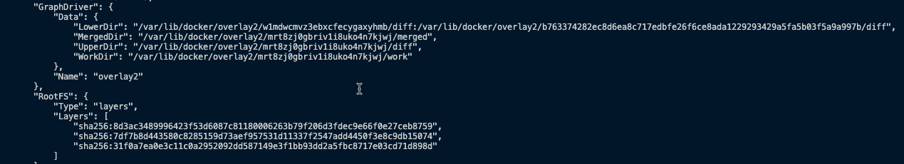

# Managing Your Docker Images

This is because Docker images consist of layers. When you create a new image using a Dockerfile, it will create more layers on top of the existing image you've built from. Each command you specify in the Dockerfile will create a new layer, with each containing all of the filesystem changes that occur before the command was performed and then after. When you run the image as a container from a Dockerfile, you're creating readable and writable layers on top of an existing group of read-only layers. This writable layer is known as the container layer.

**_When building an image from a Dockerfile, layers are created when the RUN, ADD, and COPY commands are used._**

We can inspect the layers of an image by running the `docker history <ImageName|ImageID>` command.

Now lets take a look how the layers are working in Docker

1. Create a simple Dockerfile to demostrate this

```
FROM alpine
RUN apk update
RUN apk add wget
```

2. Build the image using above Dockerfile

```
docker build -t basic-app .
```

3. Lets take a look at the layers from docker history command

```
docker history basic-app
```


4. Inspect the layers

```
docker images

docker image inscpect <ImageName|ImageID>
```



---

## Storing and Publishing Your Docker Images

These days, team may look to store production images in a cloud-based registry solution such as Azure Container Registry, Amazon Elastic Container Registry, Google Container Registry, or another option would be to set up a local registry.


Before we push images to repository we need to create a Docker registry. You can create a account on Docker Hub or any other registry.

https://hub.docker.com/signup

1. Tag the image with Docker Hub username

```
docker image tag basic-app <account_name>/<image_name>:tag
docker image tag basic-app kasunsjc/basic-app:ver1
```

2. Login to Docker Hub

```
docker login
```

3. Push the image to Docker Hub

```
docker push kasunsjc/basic-app:ver1
```


