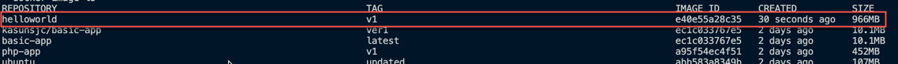
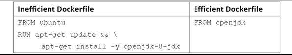
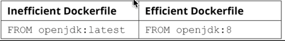
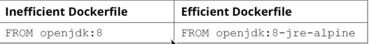

# Multi-Stage Dockerfiles

In previous section we created a Dockerfile  and use container registry to push the image to the registry.

Multi-stage Dockerfiles are a feature introduced in Docker version 17.05. This feature is preferable when we want to optimize Docker image size while running Docker images in production environments. To achieve this, a multi-stage Dockerfile will create multiple intermediate Docker images during the build process and selectively copy only essential artifacts from one stage to the other.

## Normal Docker Builds

Lets use an simple example to create a Dockerfile. This Dockerfile will build a simple hello-world image.

```
# Start from latest golang parent image
FROM golang:latest
# Set the working directory
WORKDIR /myapp
# Copy source file from current directory to container
COPY helloworld.go .
# Build the application
RUN go mod init example.com/m/v2
RUN go build -o helloworld .
# Run the application
ENTRYPOINT ["./helloworld"]
```

This Dockerfile starts with latest golang parent image and sets the working directory to /myapp. It copies the source file from current directory to container and builds the application. It runs the application.

```
package main
import "fmt"
func main() {
    fmt.Println("Hello World")
}
```

Lets build this Dockerfile.

```
docker image build -t helloworld:v1 .
```
List the existing images.

```
docker image ls  
```


Lets take a look at the size of the image. You can see its close to 1GB of size. Its not effective to have such large images in production enviornments as they will take a lot of time and bandwidth to pushed and pull from the registry.Small Docker images are much more efficient and can be pushed and pulled quickly and deployed faster.

In addition to the size of the image, these Docker images can be vulnerable to attacks since they contain build tools that can have potential security vulnerabilities.

To reduce the attack surface, it is recommended to have only the essential artifacts (for example, compiled code) and runtimes when running Docker images in production environments. As an example, with Golang, the Go compiler is required to build the application, but not to run the application.

Ideally, you want a minimal-sized Docker image that only contains the runtime tools and excludes all the build tools that we used to build the application.

---

## Introduction to Multi-Stage Dockerfiles

Multi-Staged-Build allows to use single Dockerfile to build multiple stages which produced an optimized image. Previous build stage usually include builder state and executables from source code. In multi-staged-build with different base images fro each stage and only the essential files are copied to the next stage. Multi-stage Docker builds allow us to create minimal-sized Docker images that are similar to the builder pattern but eliminate the problems associated with it.

```
# Start from latest golang parent image
FROM golang:latest AS builder 
# Set the working directory
WORKDIR /myapp
# Copy source file from current directory to container
COPY helloworld.go .
# Build the application
RUN go build -o helloworld .
# Start from latest alpine parent image
FROM alpine:latest AS runtime
# Set the working directory
WORKDIR /myapp
# Copy helloworld app from current directory to container
COPY --from=builder /myapp/helloworld .
# Run the application
ENTRYPOINT ["./helloworld"]
```

In the preceding example, we named the first stage builder and second stage runtime

## Dockerfile Best Practices

In this section, we will cover other recommended best practices for writing Dockerfiles. These best practices will ensure reduced build time, reduced image size, increased security, and increased maintainability of the Docker images produced.

### Using an Appropriate Parent Image

Its always encourage to use the official parent image for your Dockerfile. This will ensure that the image is optimized for the specific platform and architecture. This official will ensure that all best practices are followed, security paches are applied, and the image.

For example you can use openjdk official image for building Java applications, insted of using ubuntu image and installing Java on top of ubuntu.



As a best practice always avoid using **_latest_** parent image. The latest image may point in to the newer version of the image as the image is updated. The newer version may not be compatible with the current version of the application.




Next use the minimal image for your application. Most of the official Docker images in Docker Hub have a minimal-sized image built around the Alpine Linux image. For our example we can see there is a minimal-sized image for Java application.



### Using a Non-Root User for Better Security

Default user when container run as a root user (id=0). This is not a good practice as it can be a security risk. This is high risk and is considered a bad security practice when running Docker containers in production environments since hackers can gain root access to the Docker host by hacking the applications running inside the Docker container.

There are two methods that we can use to run a container as a non-root user: with the **--user (or -u)** flag, and with the **USER** directive.

### Minimizing Layers

Minimizing the number of layers in a Docker image is a good practice. This will reduce the size of the image and reduce the time it takes to push and pull the image from the registry. Each line in the DOckerfile is a layer. To achieve this, we can use the **ADD** directive to combine the commands to one.

```
FROM ubuntu:focal
RUN apt-get update \
  && apt-get install -y nginx redis-server
```

### Don't Install Unnecessary Tools

Avoide installing unnecessary tools. Such as debuggers, profilers, or performance tools.We can avoid this by specifying the **no-install-recommends** flag with the apt-get install command. Then we can remove the cache and install the packages.

```
FROM ubuntu:focal
RUN apt-get update \
    && apt-get install --no-install-recommends -y nginx \
    && rm -rf /var/lib/apt/lists/*
```

## Activity 1

<details><summary>CLICK ME</summary>
<p>

Create a go lang HTTP server with different respose based on the URL

| Invoke URL | Message |
| ------------- | ------------- |
| http://127.0.0.1:portNumber/  | Home Page  |
| http://127.0.0.1:portNumber/contact  | Contact Us |
| http://127.0.0.1:portNumber/login  | Login Page |


For this task use a Dockerfile with multi-staged build.

```
package main
import (
    "net/http"
    "fmt"
    "log"
    "os"
)
func main() {
    http.HandleFunc("/", defaultHandler)
    http.HandleFunc("/contact", contactHandler)
    http.HandleFunc("/login", loginHandler)
    port := os.Getenv("PORT")
    if port == "" {
        port = "8080"
    }
    log.Println("Service started on port " + port)
    err := http.ListenAndServe(":"+port, nil)
    if err != nil {
        log.Fatal("ListenAndServe: ", err)
        return
    }
}
func defaultHandler(w http.ResponseWriter, r *http.Request) {
    fmt.Fprintf(w, "<h1>Home Page</h1>")
}
func contactHandler(w http.ResponseWriter, r *http.Request) {
    fmt.Fprintf(w, "<h1>Contact Us</h1>")
}
func loginHandler(w http.ResponseWriter, r *http.Request) {
    fmt.Fprintf(w, "<h1>Login Page</h1>")
}
```

1. Create a folder to store the activity files.
2. Create a main.go file with the code provided in the preceding code block.
3. Create a multi-stage Dockerfile with two stages. The first stage will use the golang image. This stage will build the Golang application using the go build command. The second stage will use an alpine image. This stage will copy the executable from the first stage and execute it.
4. Build and run the Docker image.
5. Once completed, stop and remove the Docker container.

</p>
</details>